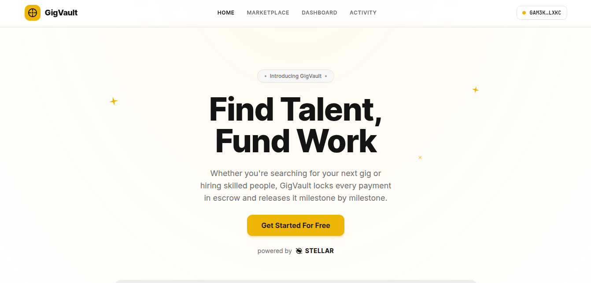

# GigVault

[](https://github.com/mishaldotrs/Gig-Vault/actions/workflows/ci.yml)
[](https://stellar.expert/explorer/testnet/contract/CDHPJQSSRGWXBEZLGWEETBO4ONYHYD42PMRUA72GIRTLH3MHKNT6UCGP)
[](contract/gigvault/src/lib.rs)
[-black?logo=nextdotjs&logoColor=white)](https://nextjs.org)
[](https://www.typescriptlang.org)
[](https://react.dev)
[](https://tailwindcss.com)
[](https://bun.sh)
[](https://www.npmjs.com/package/@stellar/stellar-sdk)
[](https://stellarwalletskit.dev)
[](https://tanstack.com/query)
[](https://zustand.docs.pmnd.rs)
[](https://gigvault-dapp.vercel.app/)
[](LICENSE)

**Find Talent, Fund Work.** A freelance marketplace built on Stellar/Soroban with **milestone escrow**, **dispute arbitration**, and **on-chain reputation scoring**. Clients fund work one milestone at a time; funds sit in the contract until the client approves the delivery — or, if the two sides disagree, until a designated arbitrator resolves it on-chain.

| | |
|---|---|
| 🔗 **Live link** | [gigvault-dapp.vercel.app](https://gigvault-dapp.vercel.app/) |
| 📜 **Stellar smart contract (Testnet)** | [`CDHPJQSSRGWXBEZLGWEETBO4ONYHYD42PMRUA72GIRTLH3MHKNT6UCGP`](https://stellar.expert/explorer/testnet/contract/CDHPJQSSRGWXBEZLGWEETBO4ONYHYD42PMRUA72GIRTLH3MHKNT6UCGP) |
| 👨‍💻 **Developed by** | [@mishaldotrs](https://x.com/mishaldotrs) | 
| 👨‍💻 **Demo Intro Video** | [on @youtube](https://youtu.be/H5WxYxQPFZo?si=DBJk-27uC7QMZ00M) | 



## Overview

GigVault replaces "trust the platform" freelance escrow with "trust the contract." Every gig is a sequence of milestones, each with its own escrow lifecycle:

```
                    ┌──(freelancer: fix & resubmit)──┐
                    ▼                                │
Pending → Funded → Submitted → Released              │
                       ↘  Disputed ──────────────────┘
                              ↘ (arbitrator) → Released | Refunded

Gig itself:  Open → InProgress → Completed
               │        │
               │        └─(freelancer rejects → escrow auto-refunds, gig reopens)
               └─(owner deletes → Cancelled)
```

A freelancer's reputation is not a database row you could fake — it's a score the contract itself updates every time a milestone is released or a dispute is lost.

### The three roles

| Role | What they do | What the contract enforces |
|---|---|---|
| **Client** | Posts gigs, funds milestones, approves deliveries, can raise disputes, can delete their still-open gigs | Only the client can fund/approve their gig's milestones; deleting is blocked once a freelancer accepts |
| **Freelancer** | Accepts gigs, submits deliveries, can fix & resubmit disputed work, can walk away (escrow auto-refunds) | Only the assigned freelancer can submit; walking away is blocked mid-dispute |
| **Arbitrator** | Resolves disputes when the parties can't settle | A fixed address set at initialization — nobody else can resolve a dispute |

### Reputation scoring

| Event | Score change |
|---|---|
| Starting score (new address) | **500 / 1000** — neutral |
| Milestone completed & approved | **+25** |
| Dispute won (arbitrator sided with freelancer) | **+10** |
| Dispute lost | **−40** |

Reaching the maximum 1000 takes 20 completed milestones — reputation is earned slowly and lost quickly, like the real thing. The score is tagged with the skill the freelancer last worked in and computed entirely inside the contract on every release/resolution.

## Features

- **Milestone escrow** — clients fund milestones individually; a freelancer only sees funds move once the client (or an arbitrator) says so.
- **Dispute arbitration** — either party can flag a funded or submitted milestone; a fixed arbitrator address resolves it in favor of either side.
- **Fix & resubmit** — a freelancer can rework a disputed delivery and resubmit it, letting both sides settle without waiting for the arbitrator.
- **Gig cancellation & rejection** — owners can delete their still-open gigs; an assigned freelancer can walk away, with escrowed funds automatically refunded to the client and the gig reopened for others.
- **On-chain reputation** — a score (0–1000, starting at a neutral 500) per address: +25 per completed milestone, +10 per dispute won, −40 per dispute lost. Computed by the contract, impossible to fake.
- **Attachments** — gig owners can attach reference images, a GitHub repo, or any link (stored off-chain, rendered on the gig card).
- **Client ↔ freelancer chat** — a per-gig message thread, highlighted during disputes so both sides can work it out.
- **Multi-wallet support** — connect with any wallet supported by StellarWalletsKit (Freighter, xBull, Albedo, Hana, Lobstr, WalletConnect, and more) through a single modal.
- **Real-time activity** — a live event feed polls the chain directly for contract events (no backend/indexer required) and a per-session transaction tracker shows pending → success/failed status with explorer links.
- **Friendly error handling** — wallet errors and all 14 contract error codes are translated into plain-language messages, never raw RPC dumps.

## Architecture

GigVault draws a hard line between what must be trustless and what's just convenience:

| Concern | Where it lives | Why |
|---|---|---|
| Escrowed funds, milestone state, gig lifecycle | **On-chain** (Soroban contract, persistent storage per gig) | Money and state transitions must be verifiable and unstoppable |
| Reputation scores | **On-chain** (persistent storage per address) | A reputation you can fake is worthless |
| Global config (admin, arbitrator, token, gig counter) | **On-chain** (instance storage) | Small, fixed-size, loaded with every call |
| Attachments (images, repo links) & per-gig chat | **Off-chain** (Next.js API routes + file store, namespaced by contract ID) | Large/mutable content doesn't belong in contract storage; swap for a DB without touching the chain |

The frontend talks to the chain two ways: **reads** are free simulations against Soroban RPC (no wallet needed — the gig list works before you even connect), and **writes** build a transaction, simulate it, get it signed by the connected wallet, submit it, and poll until it lands.

## Try the full flow (2 wallets)

1. Open the [live app](https://gigvault-dapp.vercel.app/) in two browser profiles with two funded testnet wallets ([Friendbot](https://friendbot.stellar.org) funds them free).
2. **Wallet A (client):** Post a gig — title, skill, milestones, optionally attach an image or GitHub repo.
3. **Wallet B (freelancer):** Accept the gig from the Marketplace's *Open* tab.
4. **Wallet A:** Fund milestone 1 — XLM moves into the contract (check the tx on stellar.expert).
5. **Wallet B:** Submit delivery. Try the per-gig **chat** while you're at it.
6. **Wallet A:** Approve & release — the freelancer is paid instantly and their reputation ticks up +25.
7. For the dark path: raise a dispute instead of approving, watch the milestone freeze, then **fix & resubmit** from Wallet B.

## Tech stack

| Layer | Choice |
|---|---|
| Framework | Next.js 15.5 (App Router) + TypeScript |
| Styling | Tailwind CSS + shadcn/ui (Radix primitives) |
| Wallets | `@creit.tech/stellar-wallets-kit` |
| Chain | `soroban-sdk` 22 (Rust) + `@stellar/stellar-sdk` 14 (JS) |
| Server state | TanStack Query (polling reads, mutation lifecycle) |
| Client state | Zustand (wallet session, tx tracker, live event buffer) |
| Off-chain extras | Next.js API routes (attachments + chat) |

## Project structure

```
gigvault/
├── client/                    # Next.js frontend
│   ├── app/                   # App Router pages
│   │   ├── page.tsx           # Landing page
│   │   ├── app/page.tsx       # Marketplace
│   │   ├── dashboard/page.tsx # Wallet dashboard
│   │   ├── activity/page.tsx  # Event feed + transaction history
│   │   └── api/gigs/          # Off-chain attachments + chat API routes
│   ├── components/            # ui/, gigs/, wallet/, dashboard/, activity/, layout/
│   ├── hooks/                 # useWallet, useGigVault, useEvents, useGigMeta, …
│   ├── lib/
│   │   ├── wallet/            # StellarWalletsKit singleton + connect/sign helpers
│   │   ├── stellar/           # network config, RPC client, event polling
│   │   ├── contract/          # typed GigVault contract client + contract-ids.json
│   │   ├── server/            # file-backed store for off-chain extras
│   │   └── store/             # Zustand stores (wallet, tx tracker, events)
│   └── types/                 # contract.ts, wallet.ts, events.ts, meta.ts
├── contract/                  # Soroban contract (Rust workspace)
│   └── gigvault/src/          # lib.rs (contract) + test.rs (6 tests)
├── scripts/                   # build.sh, setup-identity.sh, deploy.sh
└── README.md
```

## Setup

### 1. Prerequisites

- Node.js 20+ (or Bun)
- Rust toolchain
- [Stellar CLI](https://developers.stellar.org/docs/tools/developer-tools/cli/stellar-cli) (`stellar` command) — used for identities, build, and deploy

### 2. Install dependencies

```bash
cd client
npm install   # or: bun install
```

### 3. Environment variables

```bash
cp .env.example .env.local    # inside client/
```

At minimum you'll set `NEXT_PUBLIC_CONTRACT_ID` after deploying (the deploy script does this for you automatically).

### 4. Wallet setup

Install a Stellar wallet browser extension — [Freighter](https://www.freighter.app/) is the easiest for testnet — and switch it to **Testnet**. GigVault's "Connect wallet" button opens StellarWalletsKit's modal, which detects installed wallets automatically.

### 5. Contract deployment (Stellar Testnet)

From the repo root:

```bash
# one-time: create/fund local CLI identities (admin, arbitrator, demo accounts)
bash scripts/setup-identity.sh

# compile + optimize the contract to wasm
bash scripts/build.sh

# deploy, initialize, and write the contract ID into the frontend config
bash scripts/deploy.sh
```

`scripts/deploy.sh` prints the deployed contract ID and a stellar.expert explorer link.

### 6. Local development

```bash
cd client && npm run dev
```

Visit `http://localhost:3000`. Connect a funded testnet wallet, post a gig from **Marketplace**, and watch **Activity** update automatically as milestones move through escrow.

### 7. Deploying to Vercel

1. Push this repo to GitHub and import it into Vercel.
2. Set the project's **Root Directory** to `client`.
3. Add `NEXT_PUBLIC_CONTRACT_ID` in the Vercel project's environment variables.
4. Deploy. The contract lives on Stellar Testnet independently of the frontend host — redeploying the frontend never requires redeploying the contract.

> Note: attachments + chat use a local file store in development. On serverless hosts they won't persist between invocations — swap `client/lib/server/gig-store.ts` for a database (e.g. Neon/Postgres) for production use.

## CI/CD

Every push and pull request to `main` runs the GitHub Actions pipeline defined in [`.github/workflows/ci.yml`](.github/workflows/ci.yml):

| Job | Steps |
|---|---|
| **Frontend** | `bun install --frozen-lockfile` → `bun run lint` (ESLint) → `bun run typecheck` (tsc) → `bun run build` (Next.js production build) |
| **Contract** | Rust stable toolchain + cargo cache → `cargo test` (all 6 Soroban contract tests) |

Nothing lands on `main` broken — a lint error, type error, failed build, or failing contract test turns the pipeline red.

**Continuous deployment** is handled by Vercel's Git integration: every push to `main` that passes CI is automatically built and deployed to [gigvault-dapp.vercel.app](https://gigvault-dapp.vercel.app/). The smart contract deploys separately (and far less often) via `scripts/deploy.sh` — frontend deploys never touch the chain.

## Smart contract design

`contract/gigvault/src/lib.rs` implements:

- `initialize(admin, arbitrator, token)` — one-time setup, sets the escrow token and arbitrator address.
- `create_gig(client, title, skill, milestone_descriptions, milestone_amounts)` — posts a new gig.
- `accept_gig(freelancer, gig_id)` — assigns a freelancer to an open gig.
- `cancel_gig(client, gig_id)` — owner deletes a still-open gig (blocked once accepted).
- `reject_gig(freelancer, gig_id)` — freelancer walks away; escrowed funds auto-refund to the client and the gig reopens.
- `fund_milestone(client, gig_id, index)` — transfers escrow into the contract.
- `submit_milestone(freelancer, gig_id, index)` — marks work delivered.
- `resubmit_milestone(freelancer, gig_id, index)` — reworks a disputed milestone back to submitted.
- `approve_milestone(client, gig_id, index)` — releases escrow to the freelancer, updates reputation.
- `raise_dispute(caller, gig_id, index)` — freezes a funded/submitted milestone.
- `resolve_dispute(arbitrator, gig_id, index, favor_freelancer)` — arbitrator releases or refunds escrow, adjusts reputation.
- `get_gig`, `get_gig_count`, `get_reputation`, `get_arbitrator`, `get_token` — read-only views.

Errors are a typed `GigVaultError` enum (14 variants — not-found, wrong-role, wrong-status, etc.) so the frontend can show specific, friendly messages instead of generic panics.

Run the contract's test suite with:

```bash
cd contract && cargo test
```

## Error handling (frontend)

`client/types/wallet.ts` maps raw wallet/RPC errors into a typed `GigVaultError` with one of: `WALLET_NOT_FOUND`, `USER_REJECTED`, `INSUFFICIENT_BALANCE`, `SIMULATION_FAILED`, `NETWORK_MISMATCH`, `CONTRACT_NOT_CONFIGURED`, `UNKNOWN`. Contract error codes (`Error(Contract, #N)`) are translated to actionable messages ("A freelancer needs to accept this gig before milestones can move"), and every wallet and contract call routes through this mapping before surfacing a toast.

## Real-time updates

- **Event feed** (`client/hooks/use-events.ts`) polls `server.getEvents` against the deployed contract, decodes topics/values with `scValToNative`, and merges new events into a Zustand store — so the feed grows without ever refetching what it already has.
- **Gig list / gig detail** (`client/hooks/use-gigvault.ts`) poll contract state via TanStack Query (`refetchInterval`), so milestone status updates propagate to every open tab without a manual refresh.
- **Transaction tracker** (`client/lib/store/tx-store.ts`) moves each submitted transaction through `pending → success | failed`, storing the hash the moment it's known and linking to `stellar.expert`.
- **Chat** (`client/hooks/use-gig-meta.ts`) polls the per-gig thread every 3s while open.

## License

MIT — built as a demonstration project for Soroban smart-contract + Next.js integration.
